 

`🌱 going deep on system design & DevOps`  ·  `📩 contact@almerazisai.com`

---

> **Pick your path** 👇

🧑‍💼 I'm a recruiter

 

iOS + full-stack dev. I ship products, not just commits.
**Best look:** [SOKIO](https://sokio.app) · [mndwrk studio](https://mndwrk.co) · portfolio → [almerazisai.com](https://almerazisai.com)
📩 contact@almerazisai.com

👨‍💻 I'm a developer

 

I build design systems that don't look templated. Co-founder of [mndwrk](https://mndwrk.co)
alongside [Sofía Pérez](https://perezalmaraz.com). Currently leveling up: system design & DevOps.

🤔 Just curious

 

I care more about clean, maintainable features than collecting frameworks.
Always down to talk product + design.

---

### 🛠️ Stack

  

---

### 📌 Featured

<table>
  <tr>
    <td width="50%" valign="top">

#### 🏋️ [SOKIO](https://sokio.app)
Gym management & admin system.
`SwiftUI` · `Supabase`

  </td>
    <td width="50%" valign="top">

#### 🧱 [mndwrk](https://mndwrk.co)
Software studio — product + design.
`Studio`

  </td>
  </tr>
  <tr>
    <td width="50%" valign="top">

#### 🍺 BrewPass
_In progress._
`Swift`

  </td>
    <td width="50%" valign="top">

#### 🎨 [Portfolio](https://almerazisai.com)
Personal site _(coming soon)_.
`Web`

  </td>
  </tr>
</table>

---

### 📊 GitHub

---

Building at <a href="https://mndwrk.co">mndwrk</a> · open to iOS & full-stack collabs

